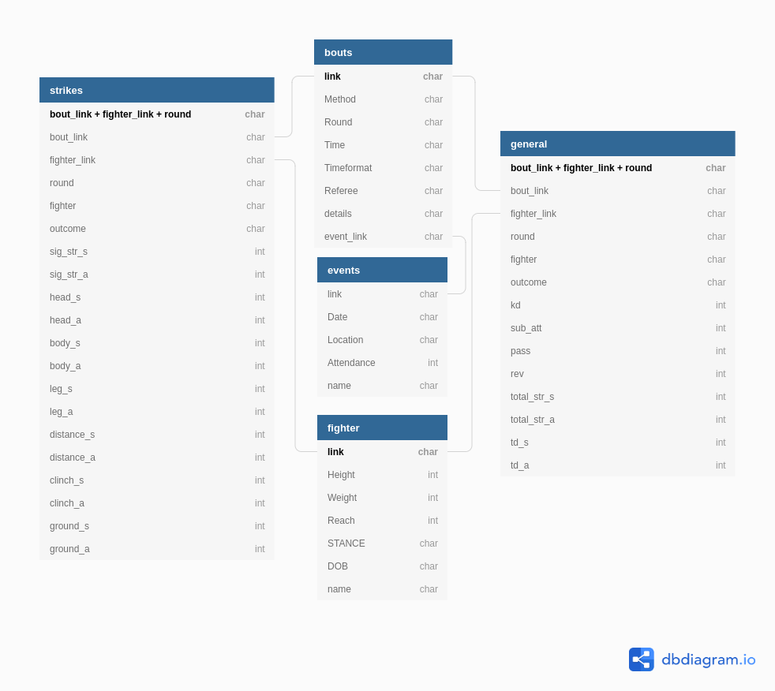

## Table of Contents:
#### Data Overview
#### 5 Tables from UFCstats
1. [Table Summaries](https://github.com/mesterhammerfic/match_stats/new/master#1-table-summaries)
2. [Schema](https://github.com/mesterhammerfic/match_stats/new/master#postgresql)
3. [Data Dictionaries](https://github.com/mesterhammerfic/match_stats/new/master#3-data-dictionaries)

#### [12 Advanced Statistics Tables]
1. [Data Dictionaries]

# Data Overview
The data I'm using is scraped from the official [UFC stats website](http://www.ufcstats.com/statistics/events/completed),
which provides round-by-round data on strikes and grappling techniques used in a fight for each fighter. I scraped data
for every bout up until August 1st. The scraping and data preparation takes a singificant amount of time, so I provided 
the [data](data/ufcstats_data) in this repository through 5 separate CSV files as well as 12 [advanced statistics](data/ufc_stats/advanced_stats) 
CSV files which were [generated](notebooks/01_data_cleaning/07c_advanced_statistics_by_round.ipynb) from those 5 original tables.

## UFC Stats
### 1. Table Summaries
Table Name | Row Represents | Number of Observations | Unique ID column
-----------|----------------|------------------------|-----------------
events.csv |one UFC Event   |525                     |link
bouts.csv  |one UFC bout    |5,688                   |link
fighters.csv|one UFC fighter|2,045                   |link
general.csv|one fighter in round|26,244              |bout_link + fighter_link + round
strikes.csv |one fighter in round|26,244              |bout_link + fighter_link + round

### 2. Schema
These 5 tables are then [transferred](notebooks/01_data_cleaning/00_create_database.ipynb) to a local postgresql database follow this schema:

## 3. Data Dictionaries
#### events.csv
Column|Meaning
------|-------
Date|Date of Event
Location|City/State/Country
Attendance|Attendance at stadium
name|Official event name
link|link to ufcstats.com event page

#### bouts.csv
Column|Meaning
------|-------
Method|Method by which the winner was determined
Round|Round at which the bout ended
Time|Time in the round at which the bout ended
Timeformat|The length and number of rounds scheduled
Referee|Self-explanatory
details|Judges scorecards if it went to decision
event_link|link to ufcstats.com page of the event this bout was in
link|link to ufcstats.com bout page

#### fighters.csv
Column|Meaning
------|-------
Height|Height in feet and inches
Weight|Weight in lbs
Reach |Reach in inches
STANCE|Most common stance the fighter uses
DOB|Date of birth
name|fighter name recorded by UFC
link|link to ufcstats.com fighter page

#### general.csv
Column|Meaning
------|-------
fighter|fighter name
kd|number of knockdowns
sig_str|(successful significant strikes) of (total sig. strike attempts)
sig_str_prcnt|% of sig. strikes that landed
total_str|includes non-significant strikes-(successful strikes) of (total attempts)
td_count|(successful takedowns) of (total attempts)
td_prcnt|% of takedowns landed
sub_att|number of submission attempts (unclear if it includes successes)
pass|number of guard passes
rev|number of reversals
round|round which the row represents
bout_id|link to bout page, should be named bout_link
outcome|Whether the fighter won, loss, draw, etc
fighter_link|link to fighter page

#### strikes.csv
Column|Meaning
------|-------
fighter|fighter name
kd|number of knockdowns
sig_str|(successful significant strikes) of (total sig. strike attempts)
sig_str_prcnt|% of sig. strikes that landed
head|(sig. strikes to opponents head) of (total head attempts)
leg|(sig. strikes to opponents leg) of (total leg attempts)
body|(sig. strikes to opponents body) of (total body attempts)
distance|(sig. strikes while at a distance) of (total distance attempts)
clinch|(sig. strikes while in a clinch) of (total clinch attempts)
ground|(sig. strikes while on the ground) of (total ground attempts)
round|round which the row represents
bout_id|link to bout page, should be named bout_link
outcome|Whether the fighter won, loss, draw, etc
fighter_link|link to fighter page

## Advanced Statistics
### 1. Data Dictionaries

#### grappling_adv.csv
Column|Meaning
------|-------
bout_id|unique bout id
fighter_id| unique fighter id
round| round which the row represents
fighter| fighter name
td_s| number of successful takedowns
td_s_pr_di| successful takedowns per round differential
td_s_p15m| successful takedowns per 15 minutes 
td_s_p15m_di| successful takedowns per 15 minutes differential
td_a| number of takedown attempts
td_a_pr_di| takedown attempts per round differential
td_a_p15m| takedown attempts per 15 minutes 
td_a_p15m_di| takedown attempts per 15 minutes differential
sba|number of submission attempts
sba_pr_di|submission attempts per round differential
sba_p15m|takedown attempts per 15 minutes
sba_p15m_di|takedown attempts per 15 minutes differential
rev| number of reversals
rev_pr_di|reversals per round ifferential
rev_p15m|reversals per 15 minutes
rev_p15m_di| per 15 minutes differential
ps| number of passes
ps_pr_di| passes per round differential
ps_p15m| passes per 15 minutes
ps_p15m_di| passes per 15 minutes differential

#### striking_adv.csv
Column|Meaning
------|-------
bout_id|unique bout id
fighter_id| unique fighter id
round| round which the row represents
fighter| fighter name
ss_s| number of significant strike successes
ss_s_pr_di| significant strike successes per round differential
ss_s_p15m| significant strike successes per 15 minutes
ss_s_p15m_di| significant strike successes per 15 minutes differential
ss_a| number of significant strike attempts
ss_a_pr_di| significant strike attempts per round differential
ss_a_p15m| significant strike attempts per 15 minutes
ss_a_p15m_di| significant strike attempts per 15 minutes differential
ts_s| number of total strike successes
ts_s_pr_di| total strike successes per round differential
ts_s_p15m| total strike successes per 15 minutes
ts_s_p15m_di| total strike successes per 15 minutes differential
ts_a| number of total strike attempts
ts_a_pr_di| total strike attempts per round differential
ts_a_p15m| total strike attempts per 15 minutes
ts_a_p15m_di| total strike attempts per 15 minutes differential
kd| number of knockdowns
kd_pr_di| knockdowns per 15 minute differential
kd_p15m| knockdowns per 15 minutes
kd_p15m_di| knockdowns per 15 minute differential

#### striking_position_adv.csv
Column|Meaning
------|-------
bout_id|unique bout id
fighter_id| unique fighter id
round| round which the row represents
fighter| fighter name

#### striking_target_adv.csv
Column|Meaning
------|-------
bout_id|unique bout id
fighter_id| unique fighter id
round| round which the row represents
fighter| fighter name
h_ss_s| number of head significant strike successes
h_ss_s_pr_di| head significant strike successes per round differential
h_ss_s_p15m| head significant strike successes per 15 minutes
h_ss_s_p15m_di| head significant strike successes per 15 minutes differential
h_ss_a| number of head significant strike attempts
h_ss_a_pr_di| head significant strike attempts per round differential
h_ss_a_p15m| head significant strike attempts per 15 minutes
h_ss_a_p15m_di| head significant strike attempts per 15 minutes differential
b_ss_s| number of body significant strike successes
b_ss_s_pr_di| body significant strike successes per round differential
b_ss_s_p15m| body significant strike successes per 15 minutes
b_ss_s_p15m_di| body significant strike successes per 15 minutes differential
b_ss_a| number of body significant strike attempts
b_ss_a_pr_di| body significant strike attempts per round differential
b_ss_a_p15m| body significant strike attempts per 15 minutes
b_ss_a_p15m_di| body significant strike attempts per 15 minutes differential
l_ss_s| number of leg significant strike successes
l_ss_s_pr_di| leg significant strike successes per round differential
l_ss_s_p15m| leg significant strike successes per 15 minutes
l_ss_s_p15m_di| leg significant strike successes per 15 minutes differential
l_ss_a| number of leg significant strike attempts
l_ss_a_pr_di| leg significant strike attempts per round differential
l_ss_a_p15m| leg significant strike attempts per 15 minutes
l_ss_a_p15m_di| leg significant strike attempts per 15 minutes differential

#### striking_target_adv.csv
Column|Meaning
------|-------
bout_id|unique bout id
fighter_id| unique fighter id
round| round which the row represents
fighter| fighter name

d_ss_s| number of distance significant strike successes
d_ss_s_pr_di| distance significant strike successes per round differential
d_ss_s_p15m| distance significant strike successes per 15 minutes
d_ss_s_p15m_di| distance significant strike successes per 15 minutes differential
d_ss_a| number of distance significant strike attempts
d_ss_a_pr_di| distance significant strike attempts per round differential
d_ss_a_p15m| distance significant strike attempts per 15 minutes
d_ss_a_p15m_di| distance significant strike attempts per 15 minutes differential
c_ss_s| number of clinch significant strike successes
c_ss_s_pr_di| clinch significant strike successes per round differential
c_ss_s_p15m| clinch significant strike successes per 15 minutes
c_ss_s_p15m_di| clinch significant strike successes per 15 minutes differential
c_ss_a| number of clinch significant strike attempts
c_ss_a_pr_di| clinch significant strike attempts per round differential
c_ss_a_p15m| clinch significant strike attempts per 15 minutes
c_ss_a_p15m_di| clinch significant strike attempts per 15 minutes differential
g_ss_s| number of ground significant strike successes
g_ss_s_pr_di| ground significant strike successes per round differential
g_ss_s_p15m| ground significant strike successes per 15 minutes
g_ss_s_p15m_di| ground significant strike successes per 15 minutes differential
g_ss_a| number of ground significant strike attempts
g_ss_a_pr_di| ground significant strike attempts per round differential
g_ss_a_p15m| ground significant strike attempts per 15 minutes
g_ss_a_p15m_di| ground significant strike attempts per 15 minutes differential
